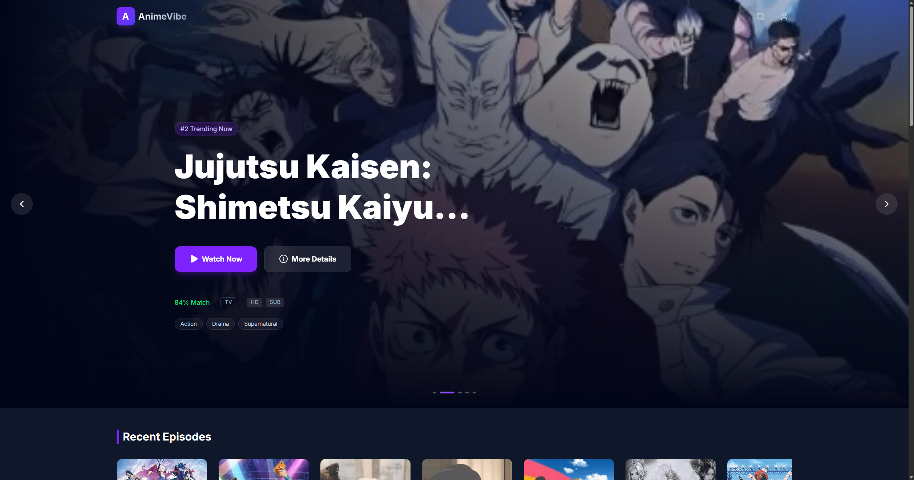

# Anime Stream

A modern, ad-free anime streaming application built with Next.js. Experience a premium interface with trending anime, comprehensive search, and a responsive video player.



## Features

- **Modern UI/UX**: Sleek, dark-themed design with smooth animations using Framer Motion.
- **Trending Anime**: Real-time trending anime carousel on the homepage.
- **Search Functionality**: Advanced search with filtering capabilities.
- **Video Player**: High-quality video playback using Vidstack with HLS support.
- **Responsive Design**: Fully responsive layout optimized for desktop and mobile.
- **Ad-Free**: Direct streaming without intrusive advertisements.

## Tech Stack

- **Framework**: [Next.js 16](https://nextjs.org/) (App Router)
- **Language**: [TypeScript](https://www.typescriptlang.org/)
- **Styling**: [Tailwind CSS 4](https://tailwindcss.com/)
- **Video Player**: [Vidstack](https://vidstack.io/)
- **Icons**: [Lucide React](https://lucide.dev/)
- **API**: [Consumet](https://docs.consumet.org/) (AnimeKai Provider)
- **Deployment**: [Vercel](https://vercel.com)

## Getting Started

Follow these steps to run the project locally:

1.  **Clone the repository:**

    ```bash
    git clone <repository-url>
    cd anime-stream
    ```

2.  **Install dependencies:**

    ```bash
    npm install
    # or
    pnpm install
    # or
    yarn install
    ```

3.  **Run the development server:**

    ```bash
    npm run dev
    # or
    pnpm dev
    # or
    yarn dev
    ```

4.  **Open the app:**

    Open [http://localhost:3000](http://localhost:3000) with your browser to see the result.

## Learn More

To learn more about Next.js, take a look at the following resources:

- [Next.js Documentation](https://nextjs.org/docs) - learn about Next.js features and API.
- [Learn Next.js](https://nextjs.org/learn) - an interactive Next.js tutorial.

## Deploy on Vercel

The easiest way to deploy your Next.js app is to use the [Vercel Platform](https://vercel.com/new?utm_medium=default-template&filter=next.js&utm_source=create-next-app&utm_campaign=create-next-app-readme) from the creators of Next.js.
